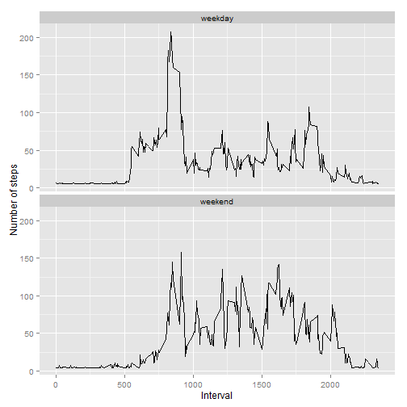

## Required Libraries

```r
library(ggplot2)
library(knitr)
```


## Download the data

The data is downloaded from https://d396qusza40orc.cloudfront.net/repdata%2Fdata%2Factivity.zip

## Read the data into R


```r
activityLog <- read.csv("activity.csv")
```

Check the data for correct type:


```r
str(activityLog)
```

```
## 'data.frame':	17568 obs. of  3 variables:
##  $ steps   : int  NA NA NA NA NA NA NA NA NA NA ...
##  $ date    : Factor w/ 61 levels "2012-10-01","2012-10-02",..: 1 1 1 1 1 1 1 1 1 1 ...
##  $ interval: int  0 5 10 15 20 25 30 35 40 45 ...
```

The variables in this dataset are:  
__steps:__ The number of steps taken per 5-minute interval  
__date:__ The date of the measurement  
__interval:__ The 5-minute interval  


The date column is showing as type Factor and needs to be converted:


```r
activityLog$date <- as.Date(activityLog$date, format = "%Y-%m-%d")
```


## Calculating the mean number of steps per day

We can see from a inspection of the data that there are quite a few NA values in the steps column of the dataset:


```r
sum(is.na(activityLog$steps))
```

```
## [1] 2304
```

These will need to be excluded when calculating the mean, median, total steps, and histogram.

The total number of steps taken each day and the associated histogram can be found with the following:


```r
stepsPerDay <- aggregate(activityLog$steps, by = list(activityLog$date), FUN=sum, na.rm=TRUE)
colnames(stepsPerDay) <- c("date", "steps")
ggplot(stepsPerDay, aes(x = steps)) + geom_histogram(fill = "blue", bin = 1000) + labs(title = "Steps Taken Per Day", x = "Steps", y = "Frequency")
```

 

Next we need to calculate the mean and median, which should be across our dataset with the NA values removed:


```r
mean(stepsPerDay$steps, na.rm=TRUE)
```

```
## [1] 9354.23
```

```r
median(stepsPerDay$steps, na.rm=TRUE)
```

```
## [1] 10395
```

## What is the Daily Average Pattern?

To find the daily, average pattern we find the mean of each interval and graph the results.


```r
dailyAvg <- aggregate(activityLog$steps, by = list(activityLog$interval), FUN=mean, na.rm = TRUE)
colnames(dailyAvg) = c("interval", "steps")

ggplot(dailyAvg, aes(x=interval, y=steps)) + geom_line(color = "black", size = 1) + labs(title="Average Daily Pattern", x="Interval", y="Number of steps")
```

 

The max 5-minute interval in the average can be found using the following:


```r
dailyAvg$interval[which.max(dailyAvg$steps)]
```

```
## [1] 835
```

Showing the 835th interval containing the max number of steps

## Inputting missing values

The number of NA values was calculated above using:


```r
sum(is.na(activityLog$steps))
```

```
## [1] 2304
```


To input the missing values we can choose an approach that seems suitable. I believe that using the mean across the set would be the best approach, which I will implement using a for loop and apply it to the entries with missing values. 


```r
updatedActivityLog <- activityLog
for (i in which(sapply(updatedActivityLog, is.numeric))) {
  updatedActivityLog[is.na(updatedActivityLog[, i]), i] <- mean(updatedActivityLog[, i],  na.rm = TRUE)
}
```


Now to make a histogram we need to aggregate and graph as we did with the original dataset


```r
updatedStepsPerDay <- as.data.frame(tapply(updatedActivityLog$steps, updatedActivityLog$date, sum))
colnames(updatedStepsPerDay) <- c("steps")
ggplot(updatedStepsPerDay, aes(x = steps)) + geom_histogram(fill = "blue", binwidth = 1000) + labs(title = "Steps Taken Per Day", x = "Steps", y = "Frequency")
```

 

Calculating the mean and median as above


```r
mean(updatedStepsPerDay$steps)
```

```
## [1] 10766.19
```

```r
median(updatedStepsPerDay$steps)
```

```
## [1] 10766.19
```

These values definitely make a difference with the mean changing from 9354.23 to 10766.19 and the median changing from 10395 to 10766.19.


## Are there differences in activity patterns between weekdays and weekends?

To find the different activity levels by weekday or weekend we can use the following


```r
updatedActivityLog$dayType <-  ifelse(as.POSIXlt(updatedActivityLog$date)$wday %in% c(0,6), 'weekend', 'weekday')
```

Then we can graph the results in a panel plot as so:


```r
updatedActivityLog <- aggregate(steps ~ interval + dayType, data=updatedActivityLog, mean)
ggplot(updatedActivityLog, aes(x=interval, y=steps)) + 
        geom_line(color="black") + 
        facet_wrap(~ dayType, nrow=2, ncol=1) +
        labs(x="Interval", y="Number of steps")
```

 


